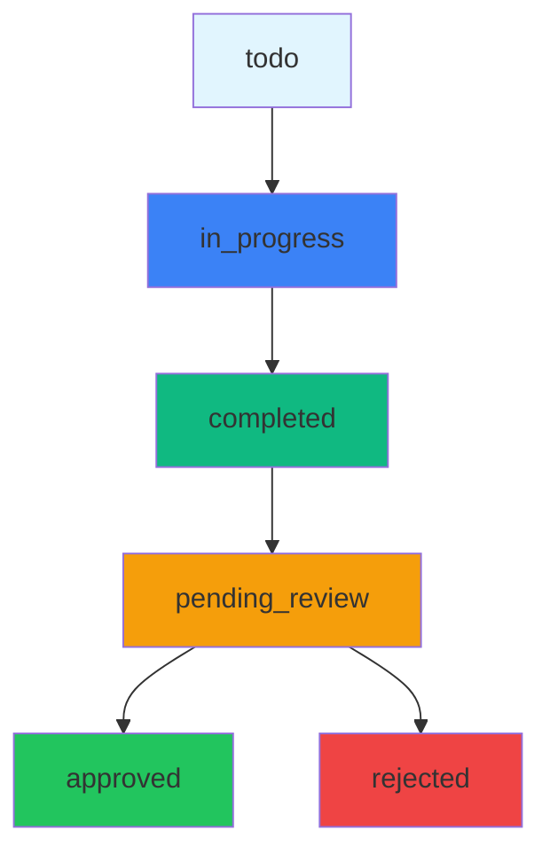

# Task Approval System - Implementation Guide

## 📋 Overview

Task approval system dengan flow sederhana namun powerful untuk mengelola task completion dan review process.

## 🔄 Task Status Flow



### **Status Definitions:**
- **`todo`** - Task baru, belum dimulai
- **`in_progress`** - Task sedang dikerjakan staff
- **`completed`** - Staff selesai kerja, menunggu review
- **`pending_review`** - Task menunggu review manager
- **`approved`** - Task disetujui manager
- **`rejected`** - Task ditolak manager

## 🗄️ Database Schema Updates

### **Task Model Enhancement**
```prisma
model Task {
  id          String       @id @default(uuid())
  title       String
  description String
  priority    TaskPriority
  status      TaskStatus   @default(todo)
  deadline    DateTime?
  
  // ✅ New fields for approval system
  completedAt  DateTime?    // Waktu staff klik "Done"
  updatedAt    DateTime     @updatedAt
  
  // Relations
  createdById String
  assignedToId String
  createdBy   User         @relation("CreatedBy", fields: [createdById], references: [id])
  assignedTo  User         @relation("AssignedTo", fields: [assignedToId], references: [id])
  
  // Existing relations
  comments     Comment[]
  activityLogs ActivityLog[]
}
```

### **TaskStatus Enum**
```prisma
enum TaskStatus {
  todo
  in_progress
  completed        // Staff selesai kerja
  pending_review   // Menunggu review manager
  approved         // Manager setujui
  rejected         // Manager tolak
}
```

## 🛠️ API Endpoints

### **1. Update Task Status (Staff)**
```http
PUT /api/tasks/:id/status
Authorization: Bearer <JWT>
Content-Type: application/json

{
  "status": "completed"
}
```

**Response:**
```json
{
  "id": "task-uuid",
  "title": "Task Title",
  "status": "completed",
  "completedAt": "2024-01-15T10:00:00Z"
}
```

### **2. Get Pending Review Tasks (Manager)**
```http
GET /api/tasks/pending-review
Authorization: Bearer <JWT>
```

**Response:**
```json
{
  "tasks": [
    {
      "id": "task-uuid",
      "title": "Task Title",
      "description": "Description",
      "status": "completed",
      "completedAt": "2024-01-15T10:00:00Z",
      "assignedTo": {
        "id": "staff-uuid",
        "name": "Staff Name",
        "email": "staff@example.com"
      },
      "deadline": "2024-01-20T00:00:00Z"
    }
  ]
}
```

### **3. Approve/Reject Task (Manager)**
```http
PUT /api/tasks/:id/review
Authorization: Bearer <JWT>
Content-Type: application/json

{
  "action": "approve", // atau "reject"
  "reviewNotes": "Optional review notes"
}
```

**Response:**
```json
{
  "id": "task-uuid",
  "status": "approved", // atau "rejected"
  "reviewedAt": "2024-01-16T09:00:00Z",
  "reviewedBy": "manager-uuid"
}
```

## 🎨 Frontend Implementation

### **1. Staff Task List UI**
```typescript
// Task card dengan status-based actions
const TaskCard = ({ task }) => {
  const getStatusActions = () => {
    switch (task.status) {
      case 'todo':
        return <Button onClick={() => startTask(task.id)}>Start Task</Button>;
      
      case 'in_progress':
        return <Button onClick={() => completeTask(task.id)}>Mark as Done</Button>;
      
      case 'completed':
        return (
          <div className="text-sm text-yellow-600">
            ⏰ Pending Review
          </div>
        );
      
      case 'pending_review':
        return (
          <div className="text-sm text-orange-600">
            👁 Under Review
          </div>
        );
      
      case 'approved':
        return (
          <div className="text-sm text-green-600">
            ✅ Approved
          </div>
        );
      
      case 'rejected':
        return (
          <div className="text-sm text-red-600">
            ❌ Rejected
          </div>
        );
    }
  };

  return (
    <Card className={getDeadlineClass(task.deadline)}>
      <CardContent>
        <h3>{task.title}</h3>
        <p>{task.description}</p>
        <div className="flex justify-between items-center mt-4">
          {getStatusActions()}
          <DeadlineWarning deadline={task.deadline} status={task.status} />
        </div>
      </CardContent>
    </Card>
  );
};
```

### **2. Manager Review UI**
```typescript
// Pending review section
const PendingReviewSection = () => {
  const [pendingTasks, setPendingTasks] = useState([]);
  const [selectedTask, setSelectedTask] = useState(null);
  const [reviewNotes, setReviewNotes] = useState('');

  const handleReview = async (action: 'approve' | 'reject') => {
    await fetch(`/api/tasks/${selectedTask.id}/review`, {
      method: 'PUT',
      headers: {
        'Authorization': `Bearer ${token}`,
        'Content-Type': 'application/json',
      },
      body: JSON.stringify({ action, reviewNotes }),
    });
    
    // Refresh pending tasks
    fetchPendingTasks();
    setSelectedTask(null);
    setReviewNotes('');
  };

  return (
    <Card>
      <CardHeader>
        <CardTitle>⏰ Pending Review</CardTitle>
        <CardDescription>Tasks completed by staff waiting for your review</CardDescription>
      </CardHeader>
      <CardContent>
        {pendingTasks.map(task => (
          <div key={task.id} className="border rounded p-4 mb-4">
            <div className="flex justify-between items-start">
              <div className="flex-1">
                <h4 className="font-medium">{task.title}</h4>
                <p className="text-sm text-gray-600">{task.description}</p>
                <div className="text-xs text-gray-500">
                  Completed: {formatDate(task.completedAt)}
                  {task.deadline && (
                    <span className="ml-2">
                      Deadline: {formatDate(task.deadline)}
                    </span>
                  )}
                </div>
              </div>
              <div className="flex gap-2">
                <Button 
                  size="sm" 
                  variant="outline"
                  onClick={() => setSelectedTask(task)}
                >
                  Review
                </Button>
              </div>
            </div>
          </div>
        ))}
      </CardContent>
    </Card>
  );
};
```

### **3. Task Detail Modal**
```typescript
// Modal untuk input progress dan hasil kerja
const TaskDetailModal = ({ task, isOpen, onClose }) => {
  const [workDetails, setWorkDetails] = useState('');
  const [workResult, setWorkResult] = useState('');
  const [isStarting, setIsStarting] = useState(false);

  const handleStartTask = async () => {
    setIsStarting(true);
    await fetch(`/api/tasks/${task.id}/status`, {
      method: 'PUT',
      headers: {
        'Authorization': `Bearer ${token}`,
        'Content-Type': 'application/json',
      },
      body: JSON.stringify({ 
        status: 'in_progress',
        workDetails,
        workResult
      }),
    });
    
    onClose();
    setIsStarting(false);
  };

  return (
    <Modal isOpen={isOpen} onClose={onClose}>
      <Card>
        <CardHeader>
          <CardTitle>Task Details: {task.title}</CardTitle>
        </CardHeader>
        <CardContent className="space-y-4">
          <div>
            <Label>Work Details</Label>
            <Textarea 
              placeholder="Describe what you've done..."
              value={workDetails}
              onChange={(e) => setWorkDetails(e.target.value)}
            />
          </div>
          
          <div>
            <Label>Work Result/Links</Label>
            <Input 
              placeholder="Results, links, or deliverables..."
              value={workResult}
              onChange={(e) => setWorkResult(e.target.value)}
            />
          </div>

          <div className="flex gap-2">
            <Button variant="outline" onClick={onClose}>
              Cancel
            </Button>
            <Button onClick={handleStartTask} disabled={isStarting}>
              {isStarting ? 'Starting...' : 'Start Task'}
            </Button>
          </div>
        </CardContent>
      </Card>
    </Modal>
  );
};
```

## 🚨 Deadline Validation

### **Backend Validation**
```typescript
const updateTaskStatus = async (taskId: string, status: string, userId: string) => {
  const task = await prisma.task.findUnique({
    where: { id: taskId },
  });

  if (!task) {
    throw new Error('Task not found');
  }

  // ❌ Validasi deadline
  if (task.deadline && task.deadline < new Date()) {
    throw new Error('Cannot modify task: Deadline has passed');
  }

  // ❌ Validasi status progression
  const validTransitions = {
    'todo': ['in_progress'],
    'in_progress': ['completed'],
    'completed': ['pending_review'],
    'pending_review': [], // Tidak bisa diubah staff
    'approved': [], // Tidak bisa diubah
    'rejected': [], // Tidak bisa diubah
  };

  if (!validTransitions[task.status]?.includes(status)) {
    throw new Error(`Invalid status transition from ${task.status} to ${status}`);
  }

  // Update task
  const updatedTask = await prisma.task.update({
    where: { id: taskId },
    data: {
      status,
      completedAt: status === 'completed' ? new Date() : undefined,
    },
  });

  return updatedTask;
};
```

### **Frontend Deadline Warning**
```typescript
const DeadlineWarning = ({ deadline, status }) => {
  if (!deadline) return null;

  const now = new Date();
  const daysUntilDeadline = Math.ceil((deadline.getTime() - now.getTime()) / (1000 * 60 * 60 * 24));
  const isOverdue = deadline < now;
  const isLocked = ['pending_review', 'approved', 'rejected'].includes(status);

  return (
    <div className={`text-sm ${isOverdue ? 'text-red-600' : daysUntilDeadline <= 3 ? 'text-yellow-600' : 'text-gray-600'}`}>
      {isOverdue ? '⚠️ Overdue' : isLocked ? '🔒 Locked' : `⏰ ${daysUntilDeadline} days left`}
    </div>
  );
};
```

## 📢 Notification System

### **Status Change Notifications**
```typescript
// Backend notification service
const createNotification = async (userId: string, message: string, type: 'info' | 'warning' | 'success') => {
  await prisma.notification.create({
    data: {
      userId,
      message,
      type,
      isRead: false,
    },
  });
};

// Trigger notifications
await createNotification(task.assignedToId, 'Task "Task Title" completed and pending review', 'info');
await createNotification(managerId, 'New task pending review: "Task Title"', 'warning');
```

## 🔐 Permission Matrix

| Action | Staff | Manager |
|--------|-------|---------|
| View own tasks | ✅ | ✅ |
| Start task | ✅ | ❌ |
| Mark as done | ✅ | ❌ |
| Edit task details | ✅ (in_progress) | ❌ |
| Review tasks | ❌ | ✅ |
| Approve/reject | ❌ | ✅ |
| Delete task | ❌ | ✅ |
| Reassign task | ❌ | ✅ |

## 🧪 Testing Scenarios

### **1. Normal Flow**
1. Staff creates task → status: `todo`
2. Staff starts task → status: `in_progress`
3. Staff completes task → status: `completed`, `completedAt` set
4. Manager sees task in pending review
5. Manager approves task → status: `approved`

### **2. Deadline Scenarios**
1. Task approaching deadline → yellow warning
2. Task overdue → red warning, block actions
3. Task completed after deadline → still allow review

### **3. Edge Cases**
1. Staff tries to edit completed task → blocked
2. Manager tries to edit approved task → blocked
3. Task assigned to wrong user → authorization error

## 📊 Reporting & Analytics

### **Manager Dashboard Metrics**
```typescript
const getManagerMetrics = async (managerId: string) => {
  const tasks = await prisma.task.findMany({
    where: {
      assignedTo: {
        managerId: managerId,
      },
    },
  });

  return {
    totalTasks: tasks.length,
    completedTasks: tasks.filter(t => t.status === 'approved').length,
    pendingReview: tasks.filter(t => t.status === 'completed').length,
    overdueTasks: tasks.filter(t => t.deadline && t.deadline < new Date() && !['approved', 'rejected'].includes(t.status)).length,
    averageCompletionTime: calculateAverageCompletionTime(tasks),
  };
};
```

## 🎯 Implementation Priority

### **Phase 1: Backend (Week 1)**
1. Update Task schema
2. Create status update endpoint
3. Create review endpoint
4. Add deadline validation
5. Add permission checks

### **Phase 2: Frontend (Week 2)**
1. Update staff task UI
2. Create pending review section
3. Add task detail modal
4. Implement deadline warnings
5. Add notification system

### **Phase 3: Enhancement (Week 3)**
1. Add analytics dashboard
2. Implement notification system
3. Add bulk actions
4. Add export functionality
5. Performance optimization

---

## 📝 Notes

- **No auto-approve**: Manager retains full control
- **Clear status flow**: Each status has clear meaning
- **Deadline enforcement**: Prevents task manipulation after deadline
- **Audit trail**: All status changes are tracked
- **User experience**: Intuitive interface with clear visual indicators

This system provides balance between staff autonomy and managerial control while maintaining clear accountability and deadline awareness.