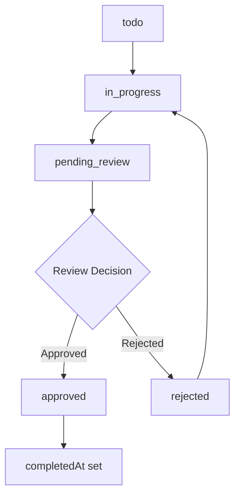
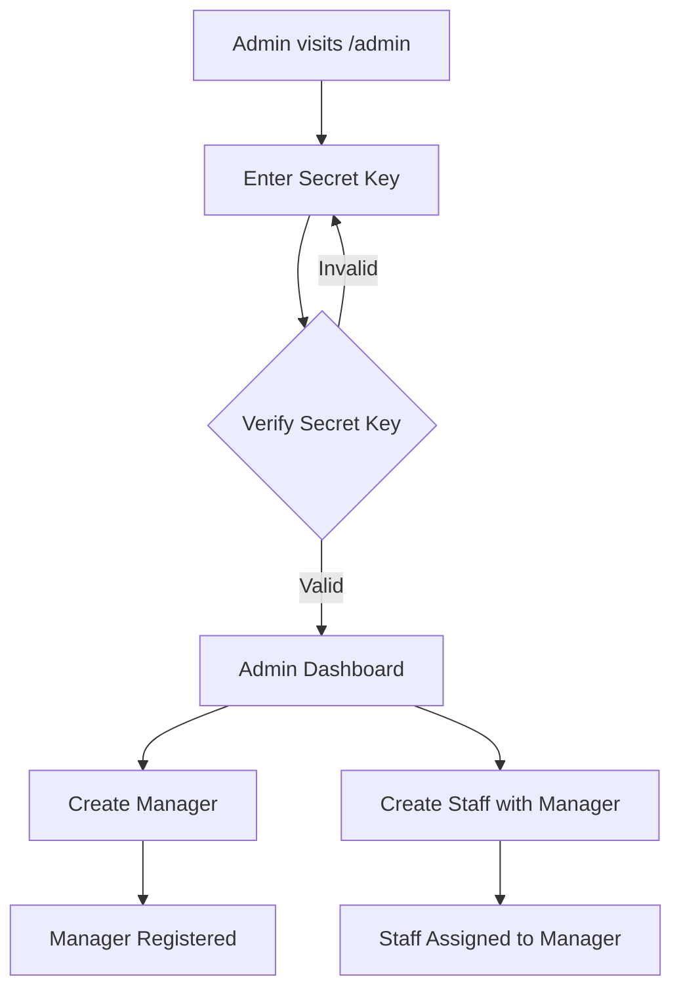
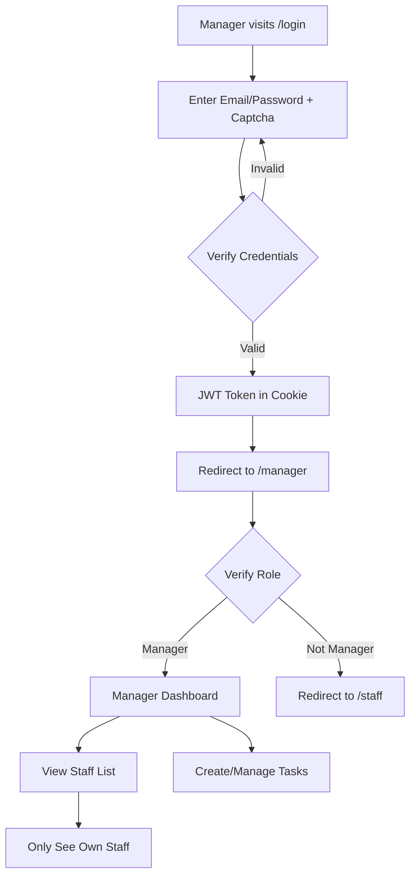
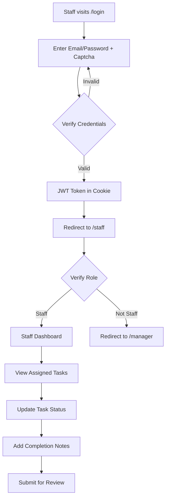

# 📋 Task Management System

A comprehensive task management application with role-based access control (Admin, Manager, Staff) built with modern web technologies. Features soft delete functionality and comprehensive task workflow management.

---

## 🚀 Tech Stack

### **Frontend**

- **Framework**: Next.js 14 (App Router)
- **Language**: TypeScript
- **Styling**: Tailwind CSS
- **UI Components**: shadcn/ui
- **Notifications**: Sonner (Toast)
- **Security**: Cloudflare Turnstile (Captcha)
- **Icons**: Lucide React

### **Backend**

- **Runtime**: Node.js
- **Framework**: Express.js
- **Language**: TypeScript
- **Database ORM**: Prisma
- **Database**: PostgreSQL
- **Authentication**: JWT (JSON Web Tokens)
- **Password Hashing**: bcryptjs
- **Validation**: Zod
- **Security**: express-rate-limit, cookie-parser

### **Development Tools**

- **Package Manager**: npm
- **Linting**: ESLint
- **Code Formatting**: Prettier
- **Version Control**: Git

---

## 📁 Project Structure

```
task-management/
├── backend/
│   ├── db/
│   │   └── prisma.ts              # Prisma client singleton
│   ├── prisma/
│   │   ├── schema.prisma          # Database schema with soft delete
│   │   └── migrations/            # Database migrations
│   ├── src/
│   │   ├── controllers/
│   │   │   ├── auth.controller.ts # Authentication logic
│   │   │   └── admin.controller.ts # Admin operations
│   │   ├── middlewares/
│   │   │   └── auth.middleware.ts # Auth & validation middleware
│   │   ├── routes/
│   │   │   ├── auth.routes.ts     # Authentication routes
│   │   │   ├── admin.routes.ts    # Admin routes
│   │   │   ├── user.routes.ts     # User management routes
│   │   │   └── task.routes.ts     # Task management routes
│   │   ├── services/
│   │   │   ├── auth.service.ts    # Business logic for auth
│   │   │   ├── user.service.ts    # User management logic
│   │   │   └── task.service.ts    # Task management logic
│   │   ├── types/
│   │   │   └── index.ts           # TypeScript type definitions
│   │   ├── utils/
│   │   │   └── verifyTurnstile.ts # Captcha verification
│   │   └── index.ts               # Express server entry point
│   ├── .env                       # Environment variables
│   └── package.json
│
└── fe-nextjs/
    ├── app/
    │   ├── admin/
    │   │   ├── AdminPanel.tsx     # Admin dashboard
    │   │   ├── SecretKeyForm.tsx  # Admin authentication
    │   │   └── page.tsx           # Admin page
    │   ├── manager/
    │   │   └── page.tsx           # Manager dashboard
    │   ├── staff/
    │   │   └── page.tsx           # Staff dashboard
    │   ├── login/
    │   │   └── page.tsx           # Login page
    │   ├── layout.tsx             # Root layout
    │   └── page.tsx               # Home page
    ├── components/
    │   └── ui/                    # shadcn/ui components
    ├── .env.local                 # Frontend environment variables
    └── package.json
```

---

## 🔐 User Roles & Permissions

### **1. Admin (Super User)**

- **Authentication**: Secret Key (X-Admin-Secret header)
- **Permissions**:
  - Create managers
  - Create staff with manager assignment
  - View all managers
  - Full system access

### **2. Manager**

- **Authentication**: Email/Password + JWT Cookie
- **Permissions**:
  - Create staff under their management
  - View only their own staff
  - Create and assign tasks to their staff
  - View all tasks they created
  - Manage their own profile

### **3. Staff**

- **Authentication**: Email/Password + JWT Cookie
- **Permissions**:
  - View tasks assigned to them
  - Update task status (todo → in_progress → pending_review → approved/rejected)
  - Add completion notes and job results
  - View their own profile
  - Cannot create or assign tasks

---

## 🗄️ Database Schema

### **User Model**

```typescript
interface User {
  id: string              // UUID
  name: string
  email: string           // Unique
  passwordHash?: string   // Optional for OAuth
  role: 'manager' | 'staff'
  isVerified: boolean     // Default: false
  managerId?: string      // Self-relation for manager-staff
  createdAt: DateTime
  updatedAt: DateTime
  deletedAt?: DateTime    // Soft delete field
}
```

### **Task Model**

```typescript
interface Task {
  id: string                    // UUID
  title: string
  description: string
  priority: 'low' | 'medium' | 'high'
  status: 'todo' | 'in_progress' | 'pending_review' | 'approved' | 'rejected'
  deadline?: DateTime
  completedAt?: DateTime
  completionNotes?: string
  jobResult: string[]          // Array of job result URLs/data
  createdById: string          // Manager who created the task
  assignedToId: string         // Staff assigned to the task
  createdAt: DateTime
  updatedAt: DateTime
  deletedAt?: DateTime         // Soft delete field
}
```

### **Comment Model**

```typescript
interface Comment {
  id: string          // UUID
  message: string
  taskId: string      // Foreign key to Task
  userId: string      // Foreign key to User
  createdAt: DateTime
  updatedAt: DateTime
  deletedAt?: DateTime // Soft delete field
}
```

### **ActivityLog Model**

```typescript
interface ActivityLog {
  id: string          // UUID
  action: string      // Description of action
  oldValue?: string   // Previous value (for updates)
  newValue?: string   // New value (for updates)
  taskId?: string     // Optional foreign key to Task
  userId: string      // Foreign key to User
  createdAt: DateTime
  deletedAt?: DateTime // Soft delete field
}
```

---

## 🔄 Task Status Workflow



**Status Descriptions:**

- **`todo`**: Initial state, task created but not started
- **`in_progress`**: Staff is actively working on the task
- **`pending_review`**: Task completed, waiting for manager review
- **`approved`**: Task approved by manager, marked as completed
- **`rejected`**: Task rejected by manager, returns to `in_progress`

---

## 🗑️ Soft Delete Implementation

All main models (`User`, `Task`, `Comment`, `ActivityLog`) implement soft delete functionality:

### **How It Works**

1. **Deletion**: Instead of permanent deletion, `deletedAt` field is set to current timestamp
2. **Filtering**: All queries automatically filter out deleted records (`deletedAt: null`)
3. **Recovery**: Deleted records can be recovered by setting `deletedAt` to `null`
4. **Integrity**: Maintains data integrity and audit trails

### **Automatic Filtering**

All database queries automatically include `deletedAt: null` filter:

```typescript
// Example: Only active users are returned
const activeUsers = await prisma.user.findMany({
  where: { deletedAt: null }
});

// Example: Login only works for active users
const user = await prisma.user.findFirst({
  where: {
    email: data.email,
    deletedAt: null
  }
});
```

### **Benefits**

- **Data Recovery**: Accidentally deleted users/tasks can be restored
- **Audit Trail**: Complete history of all actions is preserved
- **Compliance**: Meets data retention requirements
- **Analytics**: Historical data analysis remains possible

---

## 🌊 Application Flow

### **1. Admin Flow**



**Steps**:

1. Admin navigates to `/admin`
2. Enters secret key (stored in `sessionStorage`)
3. Secret key validated via `X-Admin-Secret` header
4. Access admin dashboard
5. Create managers or staff with manager assignment

---

### **2. Manager Flow**



**Steps**:

1. Manager logs in with email/password + Turnstile captcha
2. Backend validates credentials & issues JWT token (httpOnly cookie)
3. Frontend redirects to `/manager`
4. Verify role via `/api/auth/me` endpoint
5. Load dashboard with staff & tasks
6. Manager can only see staff with `managerId = manager.id`

---

### **3. Staff Flow**



**Steps**:

1. Staff logs in with email/password + Turnstile captcha
2. Backend validates & issues JWT token
3. Frontend redirects to `/staff`
4. Verify role via `/api/auth/me`
5. Load tasks where `assignedToId = staff.id`
6. Update task status through the workflow:
   - `todo` → `in_progress` (start working)
   - `in_progress` → `pending_review` (submit for review)
   - `pending_review` → `approved`/`rejected` (manager decision)
   - If rejected, back to `in_progress`

---

## 🔌 API Endpoints

### **Authentication Endpoints**

| Method | Endpoint                         | Auth          | Description                            |
| ------ | -------------------------------- | ------------- | -------------------------------------- |
| `POST` | `/api/auth/login`                | Public        | User login with Turnstile verification |
| `POST` | `/api/auth/logout`               | JWT Cookie    | Logout & clear cookie                  |
| `GET`  | `/api/auth/me`                   | JWT Cookie    | Get current authenticated user         |
| `POST` | `/api/auth/manager/create/staff` | JWT (Manager) | Manager creates staff                  |
| `POST` | `/api/auth/verify/:userId`       | JWT           | Verify user email                      |

#### **Login Example**

**Request:**

```bash
POST /api/auth/login
Content-Type: application/json

{
  "email": "manager@example.com",
  "password": "password123",
  "turnstileToken": "cloudflare-turnstile-token"
}
```

**Response:**

```json
{
  "user": {
    "id": "cm123abc",
    "email": "manager@example.com",
    "name": "John Manager",
    "role": "manager",
    "isVerified": true,
    "managerId": null,
    "createdAt": "2024-01-01T00:00:00.000Z",
    "updatedAt": "2024-01-01T00:00:00.000Z"
  }
}
```

**Cookie Set:**

```
Set-Cookie: token=eyJhbGciOiJIUzI1NiIsInR5cCI6IkpXVCJ9...; HttpOnly; Secure; SameSite=Lax; Max-Age=604800
```

---

### **User Management Endpoints**

| Method | Endpoint                    | Auth          | Description                     |
| ------ | --------------------------- | ------------- | ------------------------------- |
| `GET`  | `/api/users/staff`          | JWT (Manager) | Get all staff under manager     |
| `GET`  | `/api/users/profile`        | JWT           | Get current user profile        |
| `PUT`  | `/api/users/profile`        | JWT           | Update current user profile     |
| `PUT`  | `/api/users/password`        | JWT           | Change user password            |
| `DELETE` | `/api/users/:id`          | JWT (Admin)   | Soft delete user (Admin only)   |

#### **Get Staff Example**

**Request:**

```bash
GET /api/users/staff
Cookie: token=jwt_token_here
```

**Response:**

```json
{
  "staff": [
    {
      "id": "cm456def",
      "name": "Jane Staff",
      "email": "jane@example.com",
      "role": "staff",
      "isVerified": true,
      "managerId": "cm123abc",
      "createdAt": "2024-01-01T00:00:00.000Z",
      "updatedAt": "2024-01-01T00:00:00.000Z"
    }
  ]
}
```

---

### **Task Management Endpoints**

| Method | Endpoint                    | Auth          | Description                     |
| ------ | --------------------------- | ------------- | ------------------------------- |
| `POST` | `/api/tasks`                | JWT (Manager) | Create new task                 |
| `GET`  | `/api/tasks`                | JWT (Manager) | Get all tasks for manager       |
| `GET`  | `/api/tasks/assigned`       | JWT (Staff)   | Get tasks assigned to staff     |
| `GET`  | `/api/tasks/:id`            | JWT           | Get specific task details       |
| `PUT`  | `/api/tasks/:id`            | JWT           | Update task                     |
| `PUT`  | `/api/tasks/:id/status`     | JWT           | Update task status              |
| `DELETE` | `/api/tasks/:id`          | JWT (Manager) | Soft delete task                |

#### **Create Task Example**

**Request:**

```bash
POST /api/tasks
Content-Type: application/json
Cookie: token=jwt_token_here

{
  "title": "Complete Project Documentation",
  "description": "Write comprehensive documentation for the new feature",
  "priority": "high",
  "deadline": "2024-01-15T23:59:59.000Z",
  "assignedToId": "cm456def"
}
```

**Response:**

```json
{
  "id": "task789ghi",
  "title": "Complete Project Documentation",
  "description": "Write comprehensive documentation for the new feature",
  "priority": "high",
  "status": "todo",
  "deadline": "2024-01-15T23:59:59.000Z",
  "completedAt": null,
  "completionNotes": null,
  "jobResult": [],
  "createdById": "cm123abc",
  "assignedToId": "cm456def",
  "createdAt": "2024-01-01T00:00:00.000Z",
  "updatedAt": "2024-01-01T00:00:00.000Z"
}
```

#### **Update Task Status Example**

**Request:**

```bash
PUT /api/tasks/task789ghi/status
Content-Type: application/json
Cookie: token=jwt_token_here

{
  "status": "in_progress",
  "completionNotes": "Started working on the documentation outline"
}
```

**Response:**

```json
{
  "id": "task789ghi",
  "status": "in_progress",
  "completionNotes": "Started working on the documentation outline",
  "updatedAt": "2024-01-02T10:30:00.000Z"
}
```

---

### **Admin Endpoints**

| Method | Endpoint                    | Auth               | Description                     |
| ------ | --------------------------- | ------------------ | ------------------------------- |
| `POST` | `/api/admin/manager`        | Admin Secret       | Create new manager              |
| `POST` | `/api/admin/staff`          | Admin Secret       | Create staff with manager       |
| `GET`  | `/api/admin/managers`       | Admin Secret       | Get all managers                |
| `GET`  | `/api/admin/users`          | Admin Secret       | Get all users (including deleted) |

#### **Admin Authentication**

Admin endpoints require `X-Admin-Secret` header:

```bash
POST /api/admin/manager
Content-Type: application/json
X-Admin-Secret: your_admin_secret_key

{
  "name": "New Manager",
  "email": "newmanager@example.com",
  "password": "securepassword123"
}
```

---

### **Comment Endpoints**

| Method | Endpoint                    | Auth          | Description                     |
| ------ | --------------------------- | ------------- | ------------------------------- |
| `POST` | `/api/tasks/:id/comments`   | JWT           | Add comment to task             |
| `GET`  | `/api/tasks/:id/comments`   | JWT           | Get task comments               |
| `PUT`  | `/api/comments/:id`         | JWT           | Update comment                  |
| `DELETE` | `/api/comments/:id`       | JWT           | Soft delete comment             |

---

## 🔒 Security Features

### **Authentication & Authorization**

- **Password Hashing**: bcrypt with 10 salt rounds
- **JWT Tokens**: 7-day expiration, httpOnly cookies
- **Role-Based Access Control**: Admin, Manager, Staff roles
- **Email Verification**: Required for account activation
- **Admin Secret Key**: Separate authentication for admin operations

### **Input Validation & Sanitization**

- **Zod Schemas**: Comprehensive input validation
- **Email Format**: RFC 5322 compliant validation
- **Password Strength**: Minimum 8 characters
- **XSS Prevention**: Input sanitization
- **SQL Injection Prevention**: Prisma ORM parameterized queries

### **Rate Limiting & Protection**

- **Rate Limiting**: 100 requests per 15 minutes per IP
- **Captcha Protection**: Cloudflare Turnstile on login
- **CORS**: Configured for specific origins
- **Cookie Security**: HttpOnly, Secure, SameSite settings

### **Soft Delete Security**

- **Data Recovery**: Deleted data can be restored
- **Audit Trail**: All actions logged in ActivityLog
- **Integrity**: Foreign key constraints maintained
- **Privacy**: Deleted data filtered from normal queries

---
