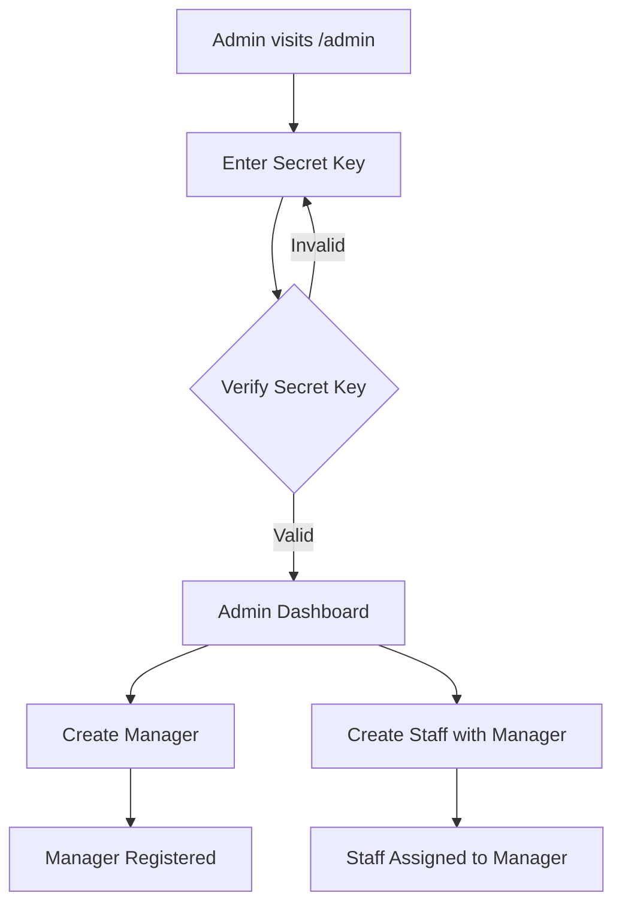
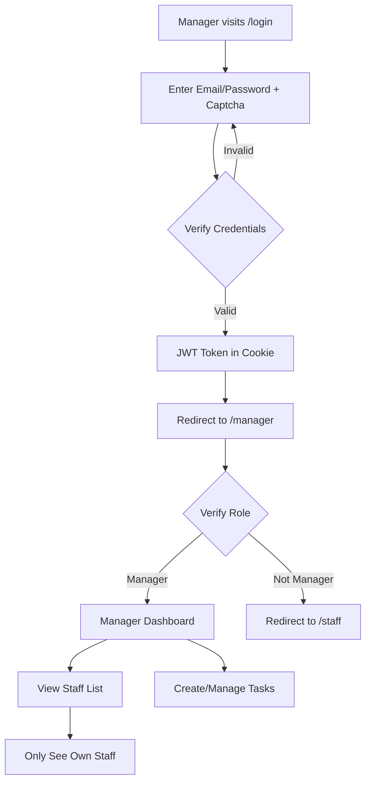
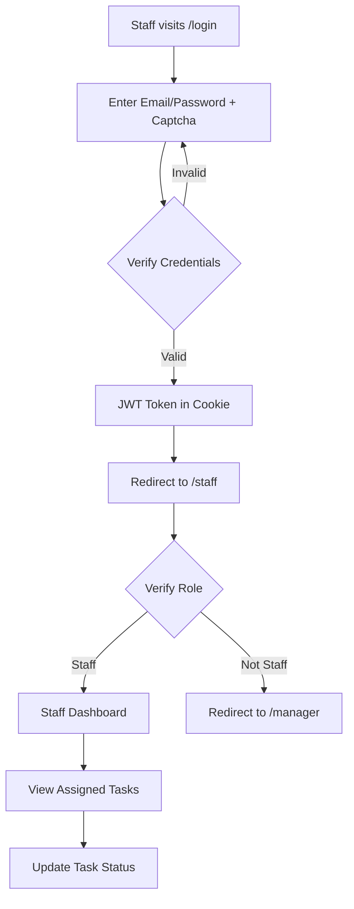

# 📋 Task Management System

A comprehensive task management application with role-based access control (Admin, Manager, Staff) built with modern web technologies. Features soft delete functionality and comprehensive task workflow management.

---

## 🚀 Tech Stack

### **Frontend**

- **Framework**: Next.js 14 (App Router)
- **Language**: TypeScript
- **Styling**: Tailwind CSS
- **UI Components**: shadcn/ui
- **Notifications**: Sonner (Toast)
- **Security**: Cloudflare Turnstile (Captcha)
- **Icons**: Lucide React

### **Backend**

- **Runtime**: Node.js
- **Framework**: Express.js
- **Language**: TypeScript
- **Database ORM**: Prisma
- **Database**: PostgreSQL
- **Authentication**: JWT (JSON Web Tokens)
- **Password Hashing**: bcryptjs
- **Validation**: Zod
- **Security**: express-rate-limit, cookie-parser

### **Development Tools**

- **Package Manager**: npm
- **Linting**: ESLint
- **Code Formatting**: Prettier
- **Version Control**: Git

---

## 📁 Project Structure

```
task-management/
├── backend/
│   ├── db/
│   │   └── prisma.ts              # Prisma client singleton
│   ├── prisma/
│   │   ├── schema.prisma          # Database schema
│   │   └── migrations/            # Database migrations
│   ├── src/
│   │   ├── controllers/
│   │   │   ├── auth.controller.ts # Authentication logic
│   │   │   └── admin.controller.ts # Admin operations
│   │   ├── middlewares/
│   │   │   └── auth.middleware.ts # Auth & validation middleware
│   │   ├── routes/
│   │   │   ├── auth.routes.ts     # Authentication routes
│   │   │   ├── admin.routes.ts    # Admin routes
│   │   │   ├── user.routes.ts     # User management routes
│   │   │   └── task.routes.ts     # Task management routes
│   │   ├── services/
│   │   │   └── auth.service.ts    # Business logic for auth
│   │   ├── types/
│   │   │   └── index.ts           # TypeScript type definitions
│   │   ├── utils/
│   │   │   └── verifyTurnstile.ts # Captcha verification
│   │   └── index.ts               # Express server entry point
│   ├── .env                       # Environment variables
│   └── package.json
│
└── fe-nextjs/
    ├── app/
    │   ├── admin/
    │   │   ├── AdminPanel.tsx     # Admin dashboard
    │   │   ├── SecretKeyForm.tsx  # Admin authentication
    │   │   └── page.tsx           # Admin page
    │   ├── manager/
    │   │   └── page.tsx           # Manager dashboard
    │   ├── staff/
    │   │   └── page.tsx           # Staff dashboard
    │   ├── login/
    │   │   └── page.tsx           # Login page
    │   ├── layout.tsx             # Root layout
    │   └── page.tsx               # Home page
    ├── components/
    │   └── ui/                    # shadcn/ui components
    ├── .env.local                 # Frontend environment variables
    └── package.json
```

---

## 🔐 User Roles & Permissions

### **1. Admin (Super User)**

- **Authentication**: Secret Key (X-Admin-Secret header)
- **Permissions**:
  - Create managers
  - Create staff with manager assignment
  - View all managers
  - Full system access

### **2. Manager**

- **Authentication**: Email/Password + JWT Cookie
- **Permissions**:
  - Create staff under their management
  - View only their own staff
  - Create and assign tasks to their staff
  - View all tasks they created
  - Manage their own profile

### **3. Staff**

- **Authentication**: Email/Password + JWT Cookie
- **Permissions**:
  - View tasks assigned to them
  - Update task status (pending → in_progress → completed)
  - View their own profile
  - Cannot create or assign tasks

---

## 🌊 Application Flow

### **1. Admin Flow**



**Steps**:

1. Admin navigates to `/admin`
2. Enters secret key (stored in `sessionStorage`)
3. Secret key validated via `X-Admin-Secret` header
4. Access admin dashboard
5. Create managers or staff with manager assignment

---

### **2. Manager Flow**



**Steps**:

1. Manager logs in with email/password + Turnstile captcha
2. Backend validates credentials & issues JWT token (httpOnly cookie)
3. Frontend redirects to `/manager`
4. Verify role via `/api/auth/me` endpoint
5. Load dashboard with staff & tasks
6. Manager can only see staff with `managerId = manager.id`

---

### **3. Staff Flow**



**Steps**:

1. Staff logs in with email/password + Turnstile captcha
2. Backend validates & issues JWT token
3. Frontend redirects to `/staff`
4. Verify role via `/api/auth/me`
5. Load tasks where `assignedToId = staff.id`
6. Update task status (pending/in_progress/completed)

---

## 🔌 API Endpoints

### **Authentication Endpoints**

| Method | Endpoint                         | Auth          | Description                            |
| ------ | -------------------------------- | ------------- | -------------------------------------- |
| `POST` | `/api/auth/login`                | Public        | User login with Turnstile verification |
| `POST` | `/api/auth/logout`               | JWT Cookie    | Logout & clear cookie                  |
| `GET`  | `/api/auth/me`                   | JWT Cookie    | Get current authenticated user         |
| `POST` | `/api/auth/manager/create/staff` | JWT (Manager) | Manager creates staff                  |
| `POST` | `/api/auth/verify/:userId`       | JWT           | Verify user email                      |

#### **Login Example**

**Request:**

```bash
POST /api/auth/login
Content-Type: application/json

{
  "email": "manager@example.com",
  "password": "password123",
  "turnstileToken": "cloudflare-turnstile-token"
}
```

**Response:**

```json
{
  "user": {
    "id": "cm123abc",
    "email": "manager@example.com",
    "name": "John Manager",
    "role": "manager"
  }
}
```

**Cookie Set:**

```
Set-Cookie: token=eyJhbGciOiJIUzI1NiIsInR5cCI6IkpXVCJ9...; HttpOnly; Secure; SameSite=Lax; Max-Age=604800
```

---
